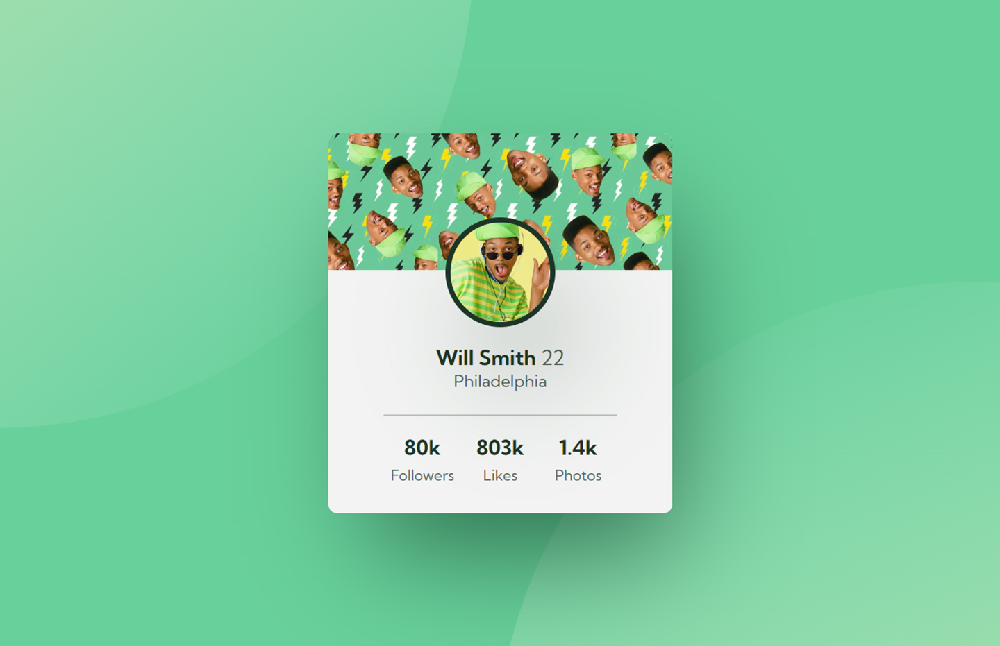

# Frontend Mentor - Profile card component

## Welcome! 👋

Thanks for checking out this front-end coding challenge.

[Frontend Mentor](https://www.frontendmentor.io) challenges help you improve your coding skills by building realistic projects.

**To do this challenge, you need a basic understanding of HTML and CSS.**

## The challenge

Your challenge is to build out this profile card component and get it looking as close to the design as possible.

You can use any tools you like to help you complete the challenge. So if you've got something you'd like to practice, feel free to give it a go.

Want some support on the challenge? [Join our Slack community](https://www.frontendmentor.io/slack) and ask questions in the **#help** channel.

# Frontend Mentor - Profile card component solution

This is a solution to the [Profile card component challenge on Frontend Mentor](https://www.frontendmentor.io/challenges/profile-card-component-cfArpWshJ). Frontend Mentor challenges help you improve your coding skills by building realistic projects. 

## Table of contents

- [Overview](#overview)
  - [The challenge](#the-challenge)
  - [Screenshot](#screenshot)
  - [Links](#links)
- [My process](#my-process)
  - [Built with](#built-with)
  - [What I learned](#what-i-learned)
  - [Continued development](#continued-development)
  - [Useful resources](#useful-resources)
- [Author](#author)
- [Acknowledgments](#acknowledgments)

## Table of contents

- [Overview](#overview)
  - [The challenge](#the-challenge)
  - [Screenshot](#screenshot)
  - [Links](#links)
- [My process](#my-process)
  - [Built with](#built-with)
  - [What I learned](#what-i-learned)
  - [Useful resources](#useful-resources)
- [Author](#author)

## Overview

### The challenge

Your challenge is to build out this Profile card component and get it looking as close to the design as possible.

You can use any tools you like to help you complete the challenge. So if you've got something you'd like to practice, feel free to give it a go.

Your users should be able to:

- View the optimal layout depending on their device's screen size
- See hover states for interactive elements.

### Screenshot

### Links

- Solution URL: [Frontend Mentor Solution](https://www.frontendmentor.io/solutions/freshprince-profile-card-component-custom-design-and-hover-states-NKHxJ_Asug)
- Live Site URL: [Live Site at Vercel](https://profile-card-component-main-chi-eight.vercel.app/)
## My process

### Built with

- Semantic HTML5 markup
- BEM
- Grid
- Custom Hover State
- Custom Design
- Responsive Design

### What I learned

I learned how to use the operator "~" to affect another element while hovering a different class/tag using CSS and a little bit of the BEM convention for a concise code.

### Useful resources

- [BEM 101](https://sparkbox.com/foundry/bem_by_example) - BEM 101
- [Affect another element on hover CSS](https://simplernerd.com/css-affect-another-element-on-hover/) - Affect another element on hover CSS
- [Code Pen - Influente a third element on hover](https://codepen.io/Alein-mo7a/pen/zdjVvz) - Influence other elements when hover a specific div

## Author
- Github - [correlucas](https://github.com/correlucas/order-summary-component)
- Frontend Mentor - [@correlucas](https://www.frontendmentor.io/profile/correlucas)

